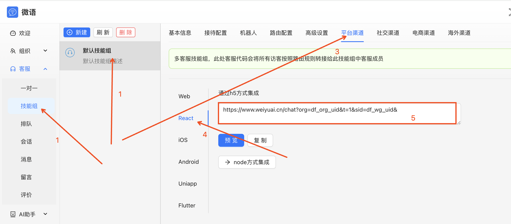
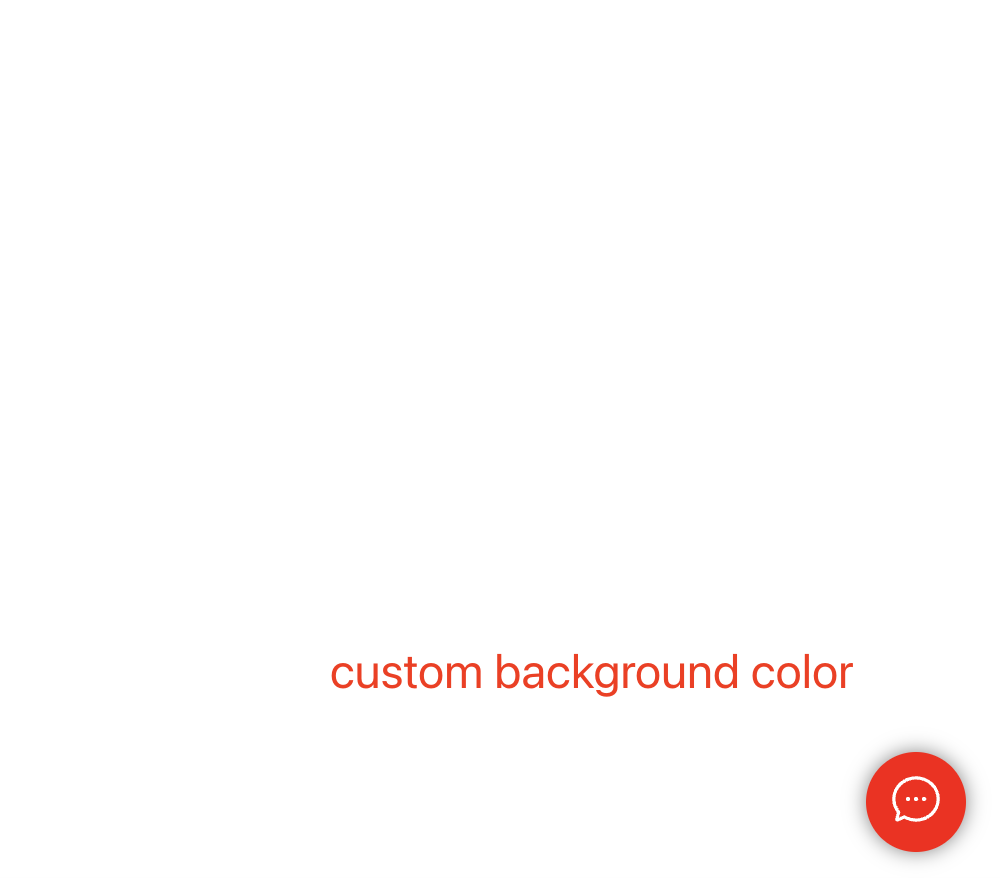
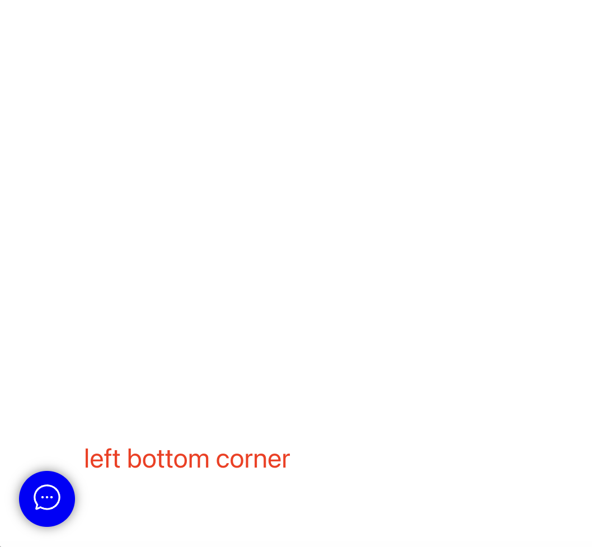
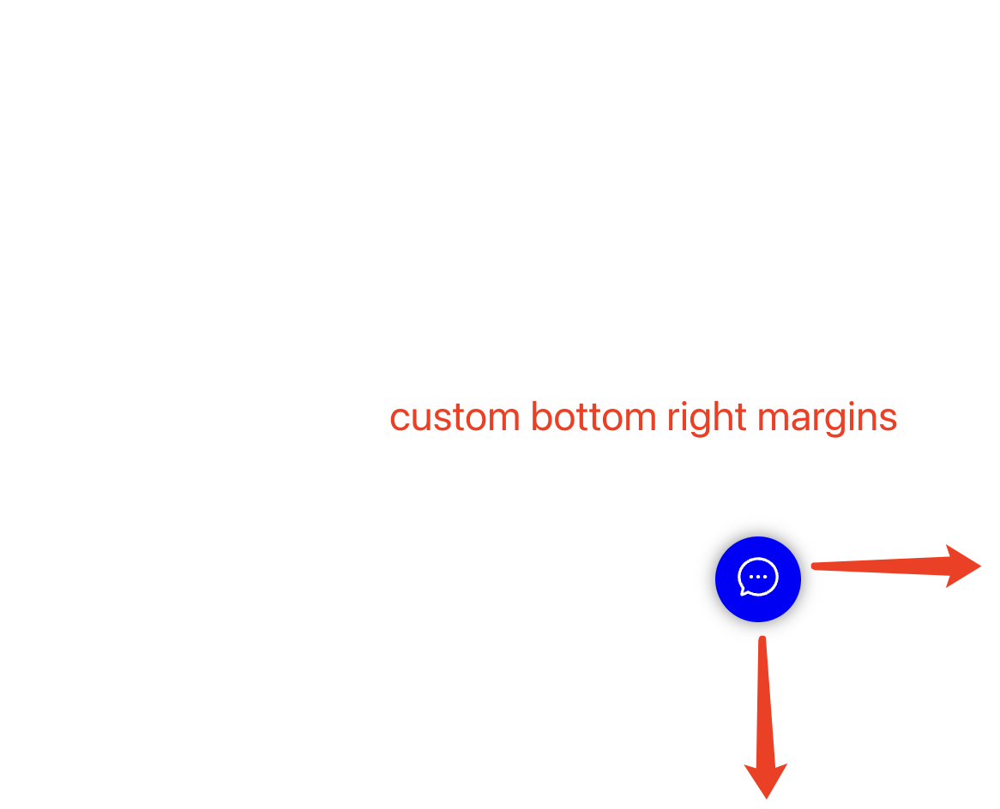

<!--
 * @Author: jackning 270580156@qq.com
 * @Date: 2023-09-25 13:30:26
 * @LastEditors: jackning 270580156@qq.com
 * @LastEditTime: 2024-10-21 16:07:24
 * @Description: bytedesk.com https://github.com/Bytedesk/bytedesk
 *   Please be aware of the BSL license restrictions before installing Bytedesk IM – 
 *  selling, reselling, or hosting Bytedesk IM as a service is a breach of the terms and automatically terminates your rights under the license. 
 *  仅支持企业内部员工自用，严禁私自用于销售、二次销售或者部署SaaS方式销售 
 *  Business Source License 1.1: https://github.com/Bytedesk/bytedesk/blob/main/LICENSE 
 *  contact: 270580156@qq.com 
 * 联系：270580156@qq.com
 * Copyright (c) 2024 by bytedesk.com, All Rights Reserved. 
-->
# bytedesk-react

[](https://npmjs.org/package/bytedesk-react)
[](https://npmjs.org/package/bytedesk-react)

## 语言

- [English](./README.md)
- [中文](./README.zh.md)

## 部分功能

- 微语官方技术支持
- 100%全部开源，支持自定义界面
- 支持人工客服
- 支持机器人
- 支持文字、图片、语音、表情
- 支持消息预知：对方正在输入
- 支持消息状态：送达、已读
- 支持消息撤回
- 对接第三方账号系统/多用户切换

## Demo 下载

- [Gitee Demo](https://gitee.com/270580156/bytedesk-react)
- [Github Demo](https://github.com/Bytedesk/bytedesk-react)

## 安装

```bash
npm install bytedesk-react --save
# or
yarn add bytedesk-react
```

## 使用

```jsx
import { ChatFloat } from "bytedesk-react";
// 
<ChatFloat
    chatUrl="http://localhost:9006/chat?t=1&sid=default_wg_uid&"
    //buttonPosition: 'right', // botton position：left or right
    //buttonBackgroundColor: 'blue', // button background color
    //iframeWidth: 400,
    //iframeHeight: 600,
    //iframeMargins: { right: 20, bottom: 20, left: 20 }, // iframe margins
    //buttonMargins: { right: 20, bottom: 20, left: 20 }, // button margins
    //showButton: true, // show button or not
    //showIframe: true // show iframe or not
/>
// params:
chatUrl: 客服链接;
```

## 获取客服链接

- [登录管理后台](https://www.weiyuai.cn/admin/cs/wgroup)
- 

## 示例

| 自定义按钮颜色 |  按钮放在窗口左下角 | 自定义按钮边距 | 自定义聊天窗口边距 | 自定义聊天窗口宽度 |
| :----------: | :----------: | :----------:  | :----------: | :----------: |
|  |  |  |  |  |

## 对话SDK

| Project     | Description           | Forks          | Stars             |
|-------------|-----------------------|----------------|-------------------|
| [iOS-swift](https://github.com/bytedesk/bytedesk-swift) | iOS swift  |  |                  |
| [Android](https://github.com/bytedesk/bytedesk-android) | Android |  |   |
| [Flutter](https://github.com/bytedesk/bytedesk-flutter) | Flutter | |  |
| [React](https://github.com/bytedesk/bytedesk-react) | React |  |  |
| [UniApp](https://github.com/bytedesk/bytedesk-uniapp) | Uniapp |  |  |
| [Web/Vue](https://github.com/bytedesk/bytedesk-web) | Web/Vue |  |  |

## 客户端

- [Windows](https://www.weiyuai.cn/download.html)
- [Mac](https://www.weiyuai.cn/download.html)
- [Linux](https://www.weiyuai.cn/download.html)
- [Android](https://www.weiyuai.cn/download.html)
- [IOS](https://www.weiyuai.cn/download.html)

## 技术栈

<!-- - [sofaboot](https://github.com/sofastack/sofa-boot/blob/master/README_ZH.md) for im server 基于金融级云原生架构-->
- [springboot-3.x for 后端](https://github.com/Bytedesk/bytedesk)
- [python for ai](https://github.com/Bytedesk/bytedesk-ai)
- [react for web前端](https://github.com/Bytedesk/bytedesk-react)
- [flutter for 移动客户端(ios&android)](https://github.com/Bytedesk/bytedesk-mobile)
- [electron for 桌面客户端(windows&mac&linux)](https://github.com/Bytedesk/bytedesk-desktop)

## 联系

- [Email](mailto:270580156@qq.com)
- [微信](./images/wechat.png)
